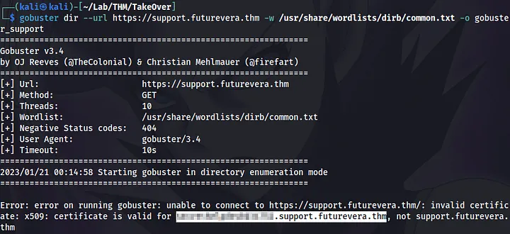
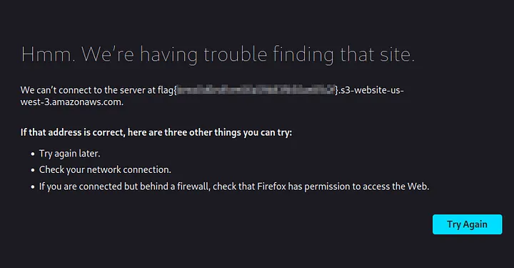
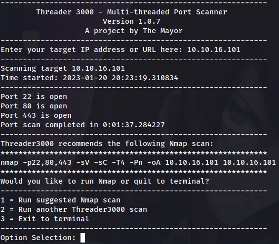
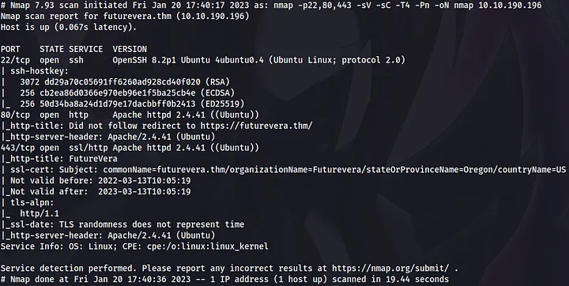
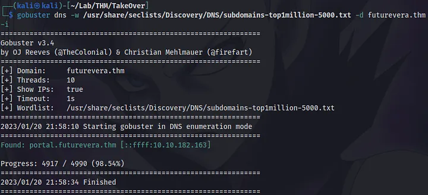
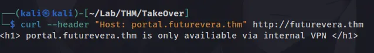
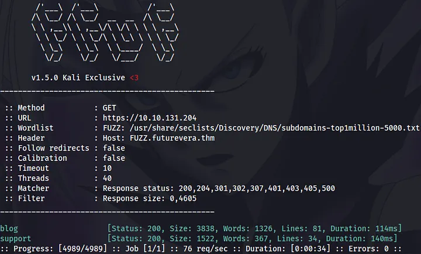
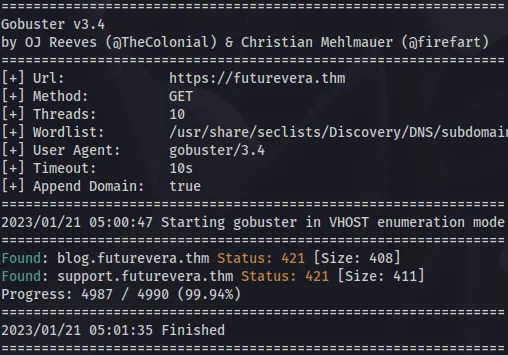
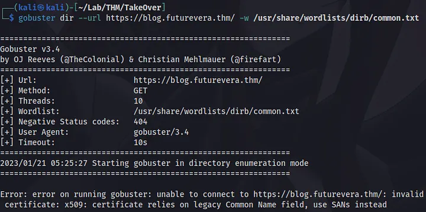
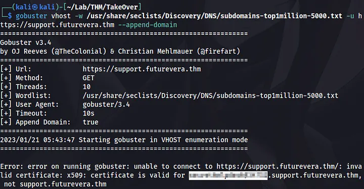

# Try Hack Me WriteUp : TakeOver

## Legend

```text
Hello there,

I am the CEO and one of the co-founders of futurevera.thm. In Futurevera, we believe that the future is in space. We do a lot of space research and write blogs about it. We used to help students with space questions, but we are rebuilding our support.

Recently blackhat hackers approached us saying they could takeover and are asking us for a big ransom. Please help us to find what they can takeover.

Our website is located at https://futurevera.thm

Hint: Don’t forget to add the MACHINE_IP in /etc/hosts for futurevera.thm ;)

Following the hint, I added the IP address to the file:
```

```bash
echo -n -e 'MACHINE_IP\tfuturevera.thm' | sudo tee -a /etc/hosts
```

Note that it won’t work with the following command:

```bash
sudo echo -n -e "MACHINE_IP\tfuturevera.thm" >> /etc/hosts
```

because in this case only echo will run as root while >> will run as the current user.

##Process

1) The description of the room itself is a hint: “This challenge revolves around subdomain enumeration.”
2) The website (https://futurevera.thm) has nothing to do with students and support, but CEO mentioned this functionality: “We used to help students with space questions, but we are rebuilding our support.”
3) So I reasonably assumed that there were subdomains like help.futurevera.thm or support.futurevera.thm.

Thus I changed my /etc/hosts file like this:

```bash
echo -n -e 'MACHINE_IP\tfuturevera.thm help.futurevera.thm support.futurevera.thm' | sudo tee -a /etc/hosts
```

Fortune followed me all the way to the flag, so I finished the enumeration phase without even starting it. Poking around for a while, I did a directory busting:

```bash
gobuster dir --url https://support.futurevera.thm -w /usr/share/wordlists/dirb/common.txt -o gobuster_support
```



Having miraculously stumbled over a self-signed certificate, I discovered a fourth-level subdomain. The -k switch, which skips certificate verification, could have spared me the discovery!

Well, it’s time to take advantage of the find:

```bash
echo -n ' obviouslyredacted.support.futurevera.thm' | sudo tee -a /etc/hosts
```

By putting this in the address bar I got the flag:



I don’t know why, but the flag can be obtained only by using HTTP (not HTTPS) URL. Strange, because I thought that you need to use HTTPS version, since there is a certificate. Even the support subdomain under the certificate.

Speaking of subdomains, HTTP version of the website has only one of them. But in order to get to it, we need to go through a thorny path. Fret not, I’ll show you the way!

Let the hell of enumeration begin! That is, the actual enumeration.

# Enumeration

I decided to investigate what would have happened if I hadn’t been lucky, so forget everything you’ve learned up to this point and enjoy this fully-fledged penetration test.

# Port Scan

Lately I have been using [threader3000](https://github.com/dievus/threader3000) to enumerate open ports prior to nmap scan. Personally, I found that it gets this job done faster than nmap.



# Service Enumeration



# Directory Busting

At this stage, the directory busting did not bear any fruit.

# Subdomain Enumeration

```bash
gobuster dns -w /usr/share/seclists/Discovery/DNS/subdomains-top1million-5000.txt -d futurevera.thm -i
```

The -i switch shows IP addresses.



Alternatively, the same result can be reproduced with the following ffuf commands:

```bash
ffuf -u http://MACHINE_IP -fc 302 -H "Host: FUZZ.futurevera.thm" -c -w /usr/share/seclists/Discovery/DNS/subdomains-top1million-5000.txt
```

```bash
ffuf -u http://futurevera.thm -fc 302 -H "Host: FUZZ.futurevera.thm" -c -w /usr/share/seclists/Discovery/DNS/subdomains-top1million-5000.txt
```

The -fc switch gets rid of responses with 302 HTTP status codes (there are a lot of them in this case).



# Virtual Host Enumeration

Yes, these are different things. Technically, the previous ffuf commands were an example of virtual host enumeration (if I get it right).

This time I used the -fs switch to filter the results based on the response size:

```bash
ffuf -u https://MACHINE_IP -fs 0,4605 -H "Host: FUZZ.futurevera.thm" -c -w /usr/share/seclists/Discovery/DNS/subdomains-top1million-5000.txt
```



Interestingly, brute-forcing of https://futurevera.thm this way does not give any results, whereas similar actions with HTTP URLs produced the same results.

The gobuster, on the contrary, gives results only with brute-force ofhttps://futurevera.thm and completely ignores https://MACHINE_IP:

```bash
gobuster vhost -u https://futurevera.thm --append-domain -k -w /usr/share/seclists/Discovery/DNS/subdomains-top1million-5000.txt
```



```bash
echo -n ' blog.futurevera.thm support.futurevera.thm' | sudo tee -a /etc/hosts
```

# Walking an Application

Since I already knew where the support.futurevera.thm leads, I decided to explore the blog and found… nothing.

# Back to Directory Busting

The blog didn’t help at all:



# Capturing the Flag

Thus, the only thing that leads to the flag is support.futurevera.thm shenanigans: whether it’s directory busting or virtual host enumeration:



# Conclusion

* It took me like an eternity to test everything and write this down.
* I mastered subdomain/vhost enumeration with ffuf and gobuster.
* After doing some research I can guess what happened. The last subdomain I found doesn’t belong to Futurevera. It was taken over by hackers. You can read more about it here.
* My head hurts.
* I’m now the CISO at Futurevera. Why did they choose me and not 0day for example? He would never. I mean they literally pay me no money! That’s why. Still good for CV and work experience though.
